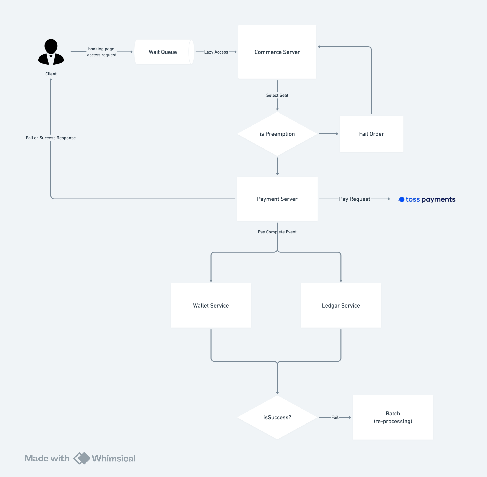

# 안정화 된 티켓팅 시스템 만들기

## 목표

- 갑작스러운 트래픽 급증에도 안정적으로 서비스를 제공할 수 있는 티켓팅 시스템을 만들어보자.
- 결제 시스템은 안정적이며 데이터 일관성이 유지되어야 한다.
- 간편한 사용성을 위해 페이먼츠 시스템도 구축해본다.
- 티켓 커머스 시스템은 이미 구축되어 있다고 가정한다.
- 외부 결제사를 통할 때 요청이 몰릴 수 있는 상황을 최소화 해본다.

## 요구사항

- 기본적인 기능인 티켓 예약, 결제, 취소, 환불 기능을 구현해보자.
- 티켓 예약은 1회에 1장만 가능하며, 결제는 1회에 1장만 가능하다.
- 결제 방법은 카드 및 계좌이체 포인트 결제를 지원한다.
- 계좌 이체는 최대 3일 이내에 완료되어야 한다.
- 티켓 선점 기준은 좌석 선택 시 선점이 완료된다. (좌석 선택 시 결제 대기 상태의 상품으로 전환하기 위한 API 필요)

## 기술 스택

### Backend

- Spring Boot
- Kotlin
- JPA

### Database

- MySQL

### Queue

- Kafka

## Flow Chart



## Code Architecture

```
payment-service
├── app
│   ├── src
│   │   ├── main
│   │   │   ├── kotlin
│   │   │   │   ├── endpoint
│   │   │   │   │   ├── domain
│   │   │   │   ├── service
│   │   │   │   │   ├── domain
│   │   │   ├── Application.kt
│   │   ├── test
│   │   │   ├── kotlin
│   │   │   │   ├── small
│   │   │   │   │   ├── service
│   │   │   │   │   │   ├── domain
│   │   │   │   ├── large
│   │   │   │   │   ├── endpoint
│   │   │   │   │   │   ├── domain
├── core
│   ├── src
│   │   ├── main
│   │   │   ├── kotlin
│   │   │   │   ├── model
│   │   │   │   │   ├── domain
│   │   │   │   ├── repository
│   │   │   │   │   ├── domain
│   │   │   │   ├── usecase
│   │   │   │   │   ├── domain
│   │   ├── test
│   │   │   ├── kotlin
│   │   │   │   ├── small
│   │   │   │   │   ├── model
│   │   │   │   │   │   ├── domain
├── infra
│   ├── src
│   │   ├── main
│   │   │   ├── kotlin
│   │   │   │   ├── infraservice
│   │   │   │   │   ├── domain
│   │   │   │   ├── repository
│   │   │   │   │   ├── domain
│   │   │   │   ├── message
│   │   │   │   │   ├── domain
│   │   │   │   ├── config
│   │   │   │   ├── util
│   │   ├── test
│   │   │   ├── kotlin
│   │   │   │   ├── small
│   │   │   │   │   ├── infraservice
│   │   │   │   │   │   ├── domain
│   │   │   │   ├── large
│   │   │   │   │   ├── repository
│   │   │   │   │   │   ├── domain
```

## Trouble Shooting